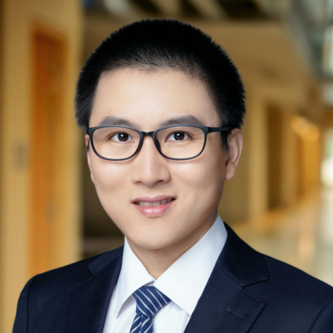

Assistant Professor of [Smith Engineering](https://smithengineering.queensu.ca/)

[Queen's University](https://www.queensu.ca/)

[Google Scholar](https://scholar.google.com/citations?user=nFoERgMAAAAJ&hl=en&oi=ao) | [Github](https://github.com/edwardcao3026)

Edward Cao is an Associate Professor of Electrical & Computer Engineering at Queen’s University, Canada. His research centers on developing advanced mathematical and computational frameworks to model stochastic gene expression dynamics with precision, interpretability, and real-world applicability.

Edward Cao employs generating-function theory, deep learning, and stochastic process analysis to address complex questions in systems and synthetic biology. His theoretical models—ranging from non-Markov transcription–translation kinetics to neural-network-accelerated solvers—act as interpretable tools for mechanism discrimination and parameter inference, and are applied in close collaboration with experimental teams working on single‐cell genomics around the world.

## Contact Information

**Email**: [z.cao@queensu.ca](mailto:z.cao@queensu.ca)

**Phone**: 613-533-6000 ext. 77680

**Address**: Dupuis Hall, Room: 211