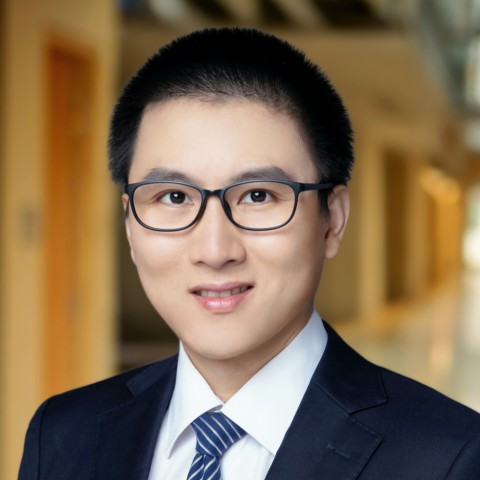
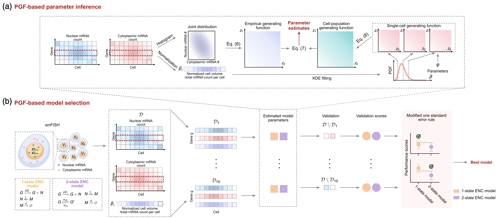
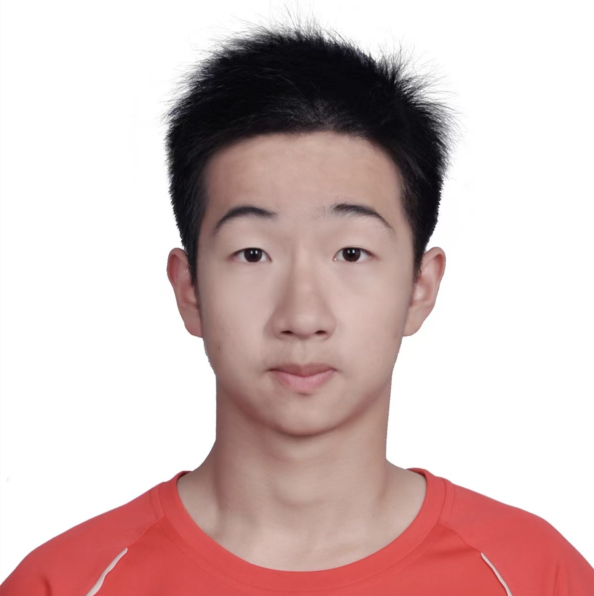

# Welcome to QUARK

<!--   -->
<!-- ## [Edward Cao](EC.md) -->

  
  

    
Assistant Professor

    <h3 class="card-title">
      <a href="EC/">Edward Cao</a>
    </h3>
    
<strong>Zhixing Cao (Edward), Ph.D.</strong>, is an Assistant Professor in the Department of Chemical Engineering at Queen’s University. He received his B.Eng. in Automatic Control from Zhejiang University (2012) and Ph.D. in Chemical and Biomolecular Engineering from the Hong Kong University of Science and Technology (2016). He conducted postdoctoral research at Harvard University and the University of Edinburgh, and became a professor at East China University of Science and Technology in 2019. He is a recipient of the NSERC Discovery Grant, MIT Technology Review Innovators Under 35 Asia Pacific (2021), a Nature Communications featured paper in computational life science (2021), the NSFC Outstanding Project Award (2021), the Alibaba Damo Academy Promising Scientist Award (2023), and ScholarGPS Highly Ranked Scholar (top 0.05%) in gene expression (2024). He serves on the editorial boards of The Innovation (IF 25.7), IEEE/CAA Journal of Automatica Sinica (IF 19.2), and others. His research focuses on AI for reaction kinetics, leveraging AI and mathematical modeling to uncover the dynamics of cellular function as a complex biochemical reaction system.

  

 

## Projects

  
  

    
Stochastic Gene Expression

    <h3 class="card-title">
      <a href="Research/">Generating-Function Models for Gene Expression</a>
    </h3>
    
We develop analytical and computational methods for stochastic models of transcription, translation, and single-cell gene-expression dynamics.

  

  
  

    
Computational Systems Biology

    <h3 class="card-title">
      <a href="Research/">Machine Learning for Biochemical Networks</a>
    </h3>
    
We build neural-network-accelerated solvers and inference tools for complex biochemical reaction systems.

  

[See our research program →](Research.md)

 

<!-- ## Research -->

## Team

  

    
    

      
PHD Student

      <h3 class="card-title"><a href="team##PHD Students/">Xinyi Zhou</a></h3>
    

  

  

    
Xinyi Zhou works on parameter inference and approximating the chemical master equations of complex biochemical reactions with neural networks.

  

  

    
    

      
PHD Student

      <h3 class="card-title"><a href="team/">Shiyue Li</a></h3>
    

  

  

    
Shiyue Li works on probability-generating-function methods for mechanistic inference and cell-state discovery from multimodal single-cell count data.

  

[See the rest of the team →](team.md)

 

## Latest Publications

**[1]** Y. Wang, J. Szavits-Nossan, **Z. Cao**\*, R. Grima\*, "Joint distribution of nuclear and cytoplasmic mRNA levels in stochastic models of gene expression: analytical results and parameter inference", *Physical Review Letters*, **135**: 068401, 2025.

**[2]** **Z. Cao**\*, Y. Wang, R. Grima\*. "Deterministic patterns in single-cell transcriptomic data",*npj Systems Biology and Applications*,**11**(1): 1-5, 2025.

**[3]** Z. Yu, G. Wang, X. Yan, Q. Jiang\*, **Z. Cao**\*,"Mutual information and attention-based variable selection for soft sensing of industrial processes", *Journal of Process Control*,**146**: 103373, 2025.

**[4]** R. Wang, J. Lu, W. Du, Q. Jiang\*, **Z. Cao**\*, "An efficient 3D cutting scheme for detecting defects on products of complex geometry", *Measurement*, **244**: 116425, 2025.

**[5]** R. Wang, W. Du, Q. Jiang\*, **Z. Cao**\*, "Defect detection in impeller parts utilising local geometric feature analysis", *International Journal of Production Research*, 1-18, 2025.

**[6]** J. Li, Z. Yu,  Q. Jiang\*, **Z. Cao**\*, "One-Class Classification Constraint in Reconstruction Networks for Multivariate Time Series Anomaly Detection", *IEEE Transactions on Instrumentation and Measurement(Early Access)*, 2025.

**[7]** X. Zhou, J. Lu, **Z. Cao**\*, R. Grima\*, "Solving the chemical master equation for stochastic biochemical systems: A variational autoencoder approach with effective reactions", *Chemical Engineering Science*, **311**, 2025.

**[8]** Z. Yu, Z. Yao, W. Wang, Q. Jiang\*, **Z. Cao**\*, "SmdaNet: A hierarchical hard sample mining and domain adaptation neural network for fault diagnosis in industrial process", *Chinese Journal of Chemical Engineering*, **84**: 106219, 2025.

**[9]** Z. Yu, G. Wang, Q. Jiang\*, X. Yan, **Z. Cao**, "Enhanced variational autoencoder with continual learning capability for multimode process monitoring", *Control Engineering Practice*, **156**: 106219, 2025.

[See Full Publications →](Publications.md)
