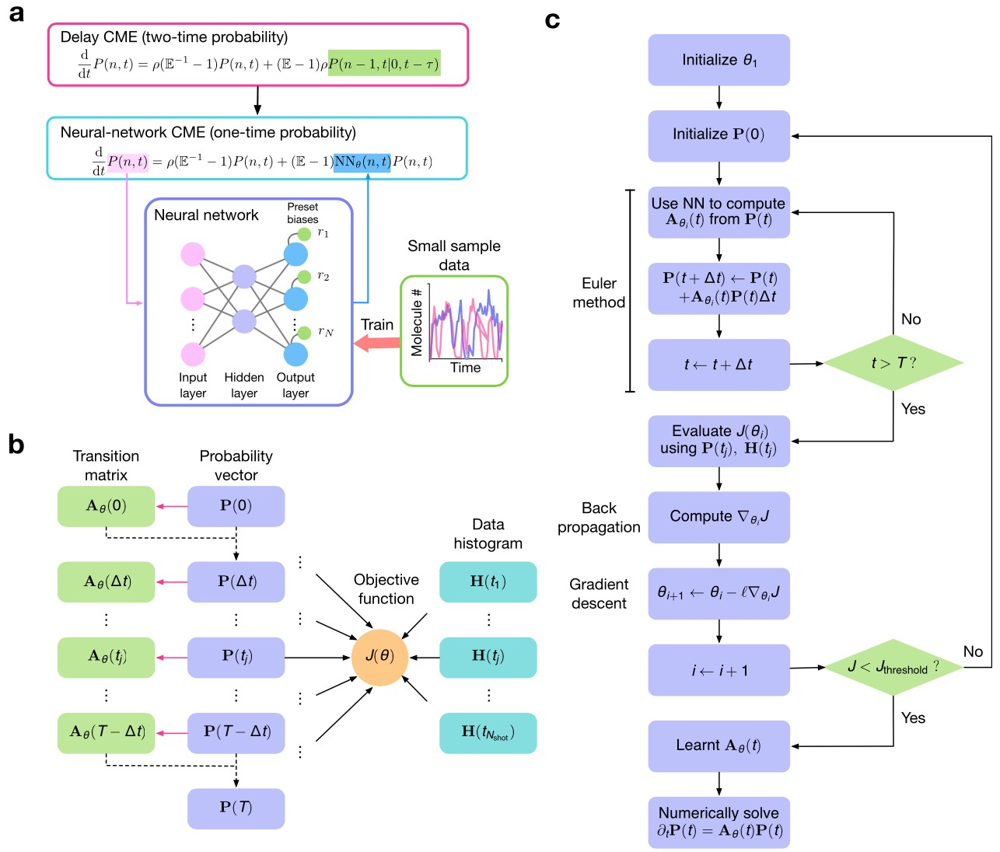

# Welcome to QUARK

<!--   -->
<!-- ## [Edward Cao](EC.md) -->

  
  

    
Associate Professor

    <h3 class="card-title">
      <a href="EC/">Edward Cao</a>
    </h3>
    
Edward Cao is an Associate Professor of Electrical & Computer Engineering at Queen’s University, Canada. His research centers on developing advanced mathematical and computational frameworks to model stochastic gene expression dynamics with precision, interpretability, and real-world applicability.

    
Edward Cao employs generating-function theory, deep learning, and stochastic process analysis to address complex questions in systems and synthetic biology. His theoretical models—ranging from non-Markov transcription–translation kinetics to neural-network-accelerated solvers—act as interpretable tools for mechanism discrimination and parameter inference, and are applied in close collaboration with experimental teams working on single‐cell genomics around the world.

  

 

## Projects

  
  

    
Mathematical Biology

    <h3 class="card-title">
      <a href="Research/">Principles of Enzyme and Biochemical Kinetics</a>
    </h3>
    
We are deriving rate equations and developoing standard based approaches to measure the physical constants of biopchemical reactions.

  

  
  

    
Scientometrics

    <h3 class="card-title">
      <a href="Research/">Measuring and Improving Research University Performance</a>
    </h3>
    
We are developing new metrics and models to measure and improve performance of scientists, research universities, and academic policies.

  

[See our research program →](Research.md)

 

<!-- ## Research -->

## Team

  
  

    
PHD Student

    <h3 class="card-title"><a href="team##PHD Students/">Xinyi Zhou</a></h3>
    
Xinyi Zhou works on parameter inference and approximating the chemical master equations of complex biochemical reactions with neural networks.

  

  
  

    
PHD Student

    <h3 class="card-title"><a href="team##Postdoctoral Fellows/">Yiling Wang</a></h3>
    
Isabella is investigating the effects of macromolecular crowding on protein aggregation using 
    rule-based models.

  

[See the rest of the team →](team.md)

 

## Latest Publications

**[1]** Y. Wang, J. Szavits-Nossan, **Z. Cao**\*, R. Grima\*, "Joint distribution of nuclear and cytoplasmic mRNA levels in stochastic models of gene expression: analytical results and parameter inference", *Physical Review Letters*, **135**: 068401, 2025.

**[2]** **Z. Cao**\*, Y. Wang, R. Grima\*. "Deterministic patterns in single-cell transcriptomic data",*npj Systems Biology and Applications*,**11**(1): 1-5, 2025.

**[3]** Z. Yu, G. Wang, X. Yan, Q. Jiang\*, **Z. Cao**\*,"Mutual information and attention-based variable selection for soft sensing of industrial processes", *Journal of Process Control*,**146**: 103373, 2025.

**[4]** R. Wang, J. Lu, W. Du, Q. Jiang\*, **Z. Cao**\*, "An efficient 3D cutting scheme for detecting defects on products of complex geometry", *Measurement*, **244**: 116425, 2025.

**[5]** R. Wang, W. Du, Q. Jiang\*, **Z. Cao**\*, "Defect detection in impeller parts utilising local geometric feature analysis", *International Journal of Production Research*, 1-18, 2025.

**[6]** J. Li, Z. Yu,  Q. Jiang\*, **Z. Cao**\*, "One-Class Classification Constraint in Reconstruction Networks for Multivariate Time Series Anomaly Detection", *IEEE Transactions on Instrumentation and Measurement(Early Access)*, 2025.

**[7]** X. Zhou, J. Lu, **Z. Cao**\*, R. Grima\*, "Solving the chemical master equation for stochastic biochemical systems: A variational autoencoder approach with effective reactions", *Chemical Engineering Science*, **311**, 2025.

**[8]** Z. Yu, Z. Yao, W. Wang, Q. Jiang\*, **Z. Cao**\*, "SmdaNet: A hierarchical hard sample mining and domain adaptation neural network for fault diagnosis in industrial process", *Chinese Journal of Chemical Engineering*, **84**: 106219, 2025.

**[9]** Z. Yu, G. Wang, Q. Jiang\*, X. Yan, **Z. Cao**, "Enhanced variational autoencoder with continual learning capability for multimode process monitoring", *Control Engineering Practice*, **156**: 106219, 2025.

[See Full Publications →](Publications.md)

