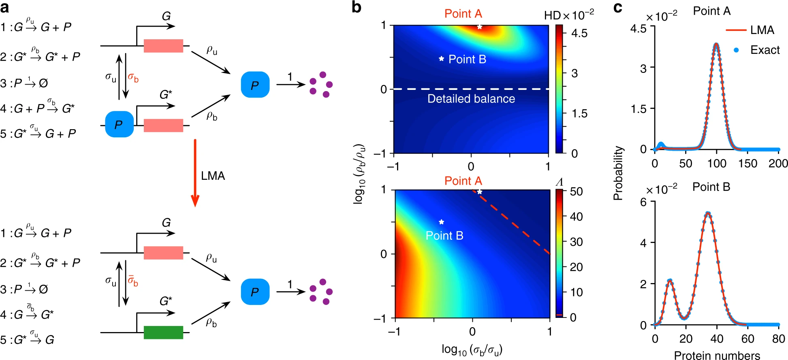

# Joining our research team

## Skills Overview for Research Group

Santiago welcomes inquiries from prospective graduate students, postdoctoral researchers, and collaborators who share a passion for advancing fundamental and applied research in the biomedical sciences, biology, chemistry, mathematics, and the science of science.

Successful applicants to the group typically possess strong foundations in applied mathematics, dynamical systems, statistical modeling, or computational biology, along with a deep interest in using quantitative methods to investigate complex biological phenomena. Experience with ordinary and stochastic differential equations, asymptopic analysis and approximations, parameter estimation, and numerical simulation is especially valuable. Proficiency in cross-platform programming in MATLAB, Python, Julia, or C++, as well as fluency with scientific software development environments and tools (e.g., Git, Jupyter, LaTeX, or CI workflows), is highly desirable. Competence in symbolic computation, optimization, uncertainty quantification, or data standards such as EnzymeML and STRENDA further distinguishes outstanding candidates.

We also welcome applicants with interests in the science of science, including topics such as the reproducibility of biomedical research, bibliometric modeling, meta-analysis of funding and publication systems, and the design of data standards and infrastructures. Candidates with experience in data mining, network analysis, machine learning, or statistical modeling of scientific activity are especially encouraged to apply.

Applicants are expected to work effectively both independently and in collaboration with other group members and external partners. Intellectual curiosity, scientific rigor, and a collegial approach to interdisciplinary inquiry are essential for thriving in our research environment.

## Graduate Students

Prospective Ph.D. students interested in joining our team are encouraged to apply through the Mathematics Graduate Program, the Quantitative Biomedical Sciences Program, or the Molecular and Cellular Biology Graduate Program.

Applicants should select the graduate program that best aligns with their foundational training and future career aspirations.

## Postdoctoral Fellowships and Visiting Researcher Opportunities

Postdoctoral candidates with relevant expertise are welcome to inquire about potential opportunities. Applications should include:

- A cover letter outlining your research interests.
- A curriculum vitae (CV).
- A research proposal (2–3 pages) that situates your work within the context of our research projects and publications.
- Names and contact information for three references.

Please send inquiries to: santiago.schnell@dartmouth.edu

Santiago also welcomes inquiries from self-funded graduate students, postdoctoral fellows, and visiting faculty on sabbatical leave. Please send a cover letter describing your interest in our research group, your full CV, and the names and contact information for references to Dr. Schnell at the email address above.
